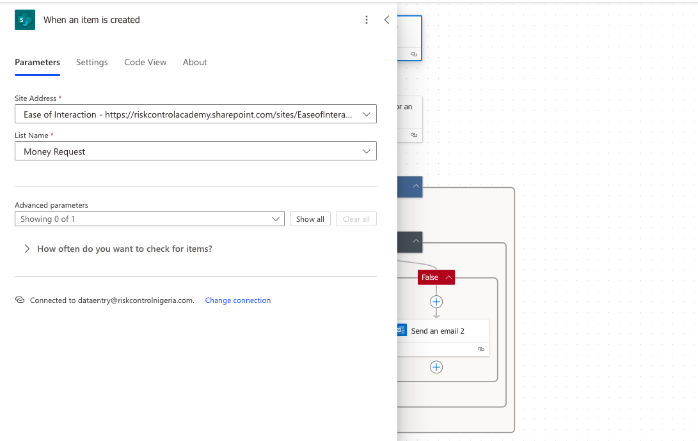
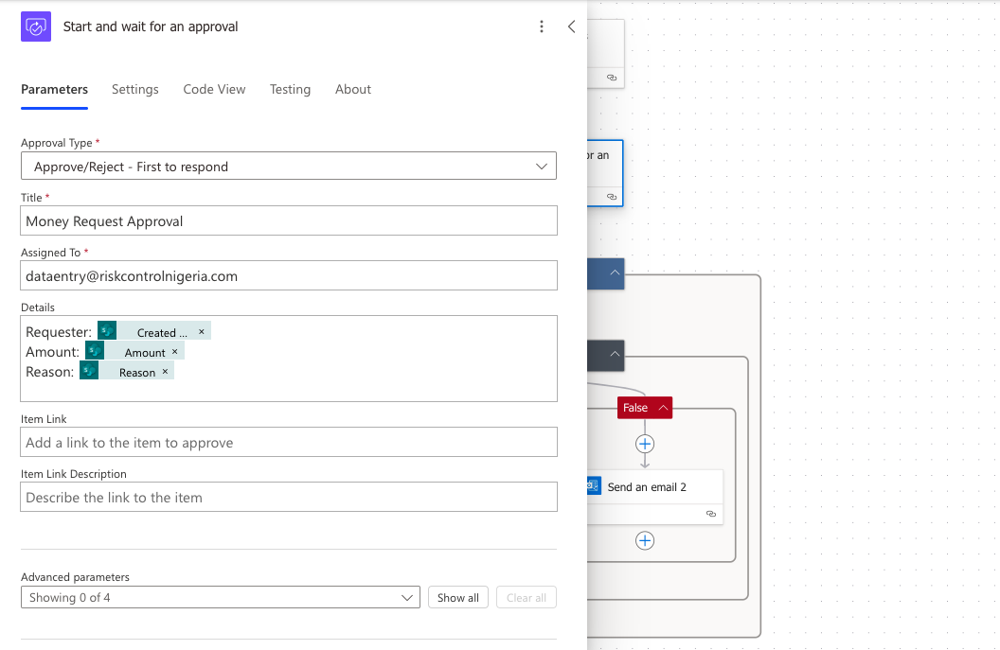
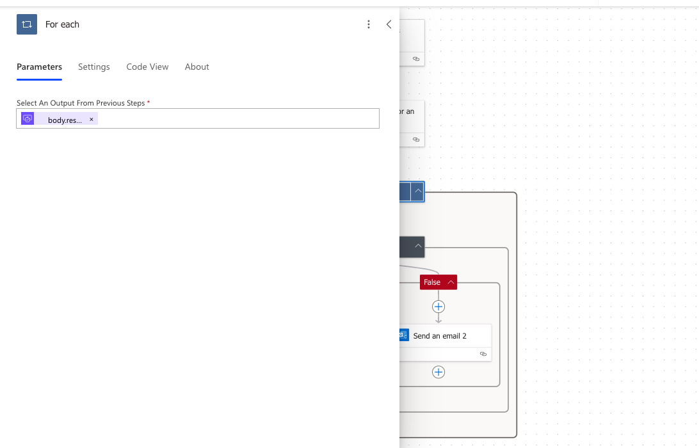
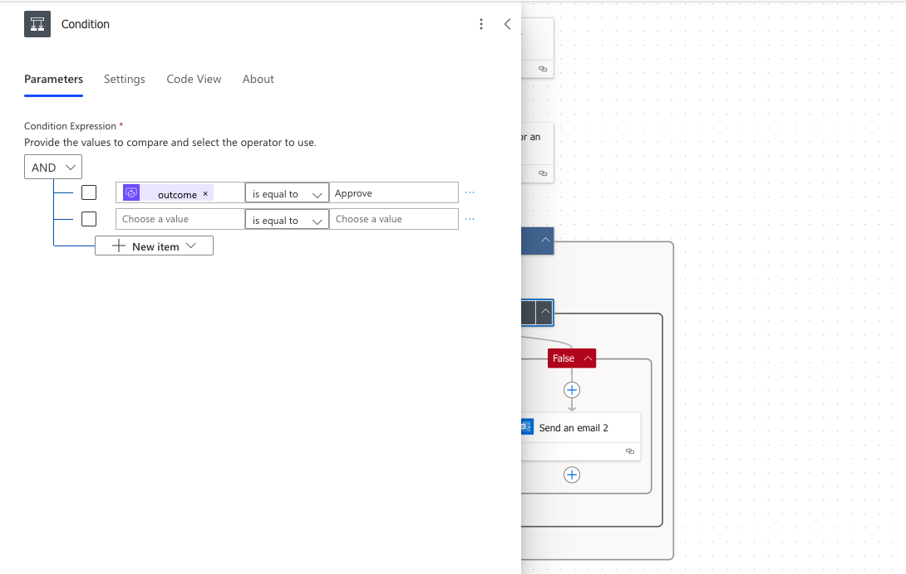
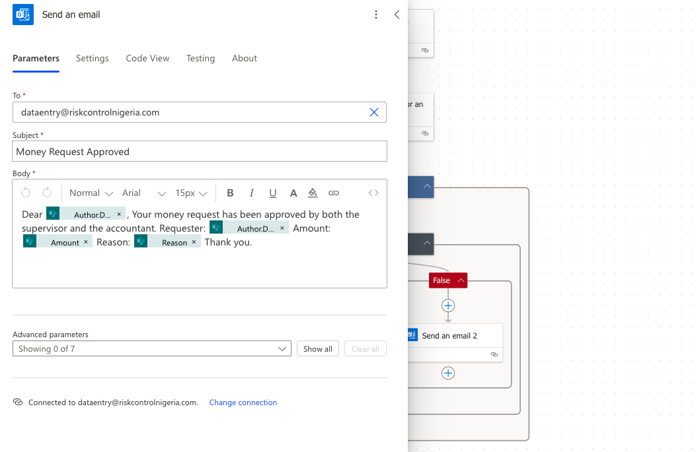
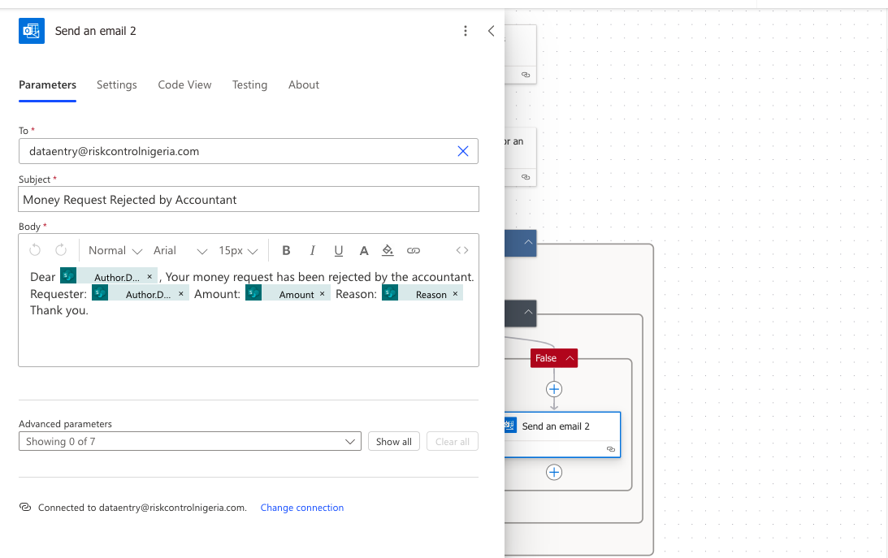
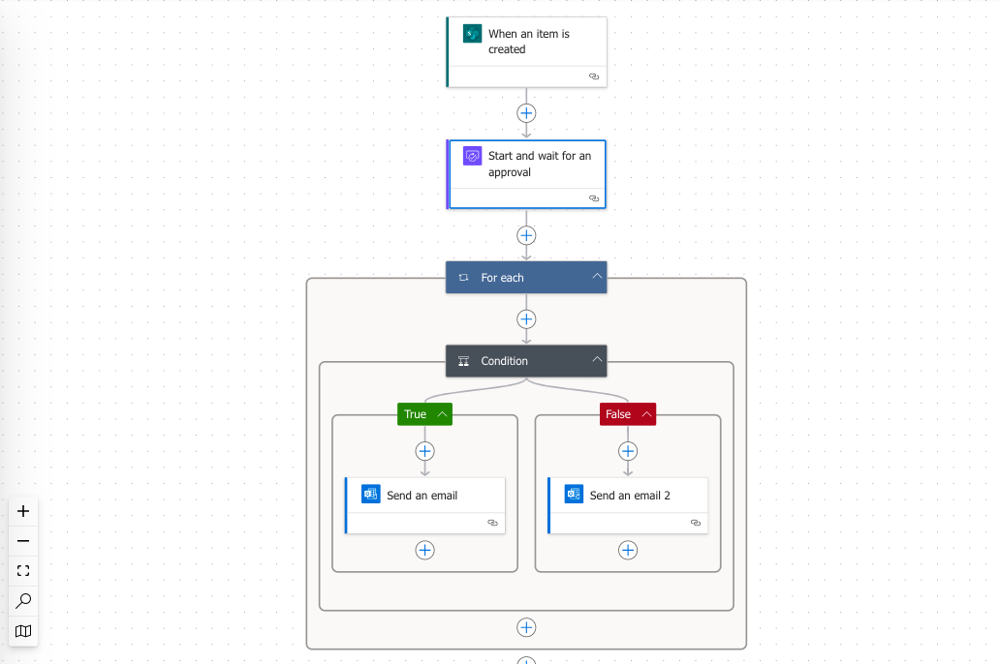

# Power-Automation-Money-Request-Automation
Documentation and resources for the Power Automate flow that handles money request approvals from the IT department's SharePoint list.
# Money Request Automation

This repository contains the documentation and resources for the Power Automate flow that handles money request approvals from the IT department's SharePoint list. The flow automates the approval process, sending emails to the Accountant and notifying the requester of the decision.

## Repository Contents

- [Overview](#overview)
- [Flow Structure](#flow-structure)
- [Screenshots](#screenshots)
- [Contact](#contact)

## Overview

The Money Request Automation flow performs the following steps:
1. **Trigger**: When an item is created in the SharePoint list.
2. **Approval Request**: The flow sends an approval request to the Accountant.
3. **Conditions**: The flow checks if the Accountant approves or rejects the request.
4. **Notification**: Based on the Accountant's response, the flow sends an approval or rejection email to the requester.

## Flow Structure

1. **Trigger**: When an item is created in the SharePoint list.
2. **Start and Wait for an Approval**: Sends an approval request email to the Accountant.
3. **Conditions**:
   - **If True (Approved)**: Sends an approval email to the requester.
   - **If False (Rejected)**: Sends a rejection email to the requester.

## Screenshots

Below are the screenshots of each step in the Power Automate flow:

### 1. When an item is created

### 2. Start and wait for an approval

### 3. For Each

### 4. Conditions
#### If True (Approved)

#### If False (Rejected)

### 4. Send an approval email

### 5. Send a rejection email

### 6. Overview of the Automation

## Contact

For any questions or issues regarding the Money Request Automation flow, please contact the IT support team at [it-support@RCS.com](mailto:it-support@example.com).
